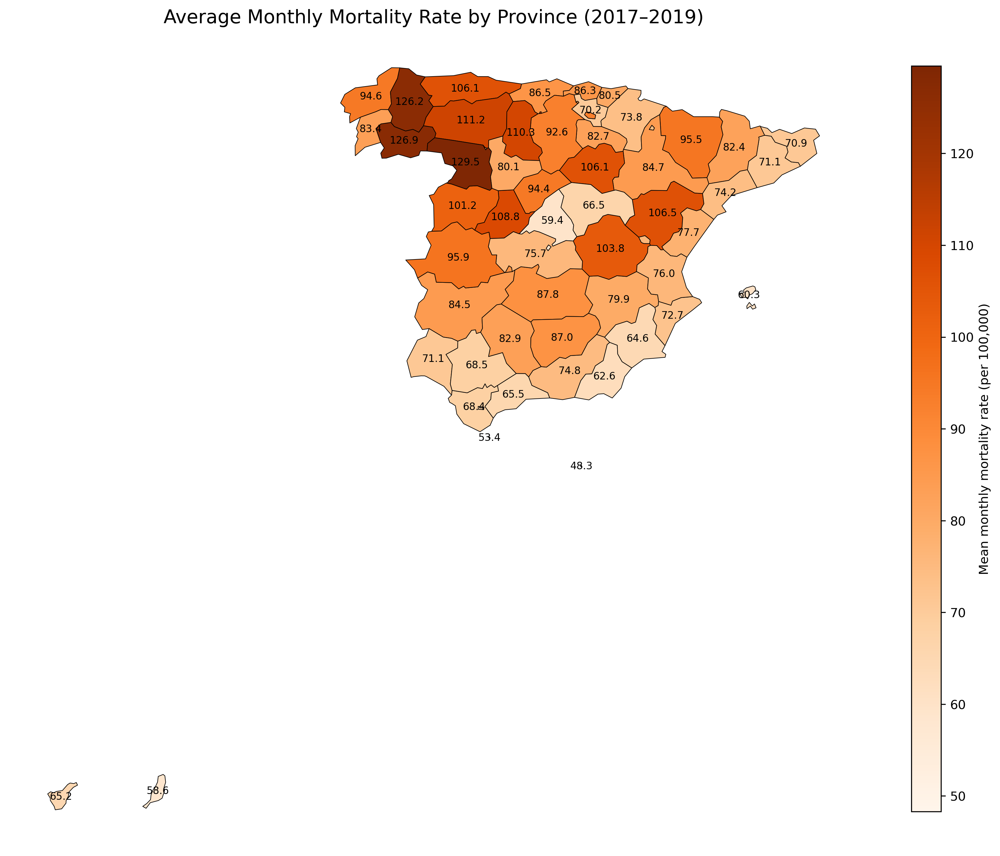
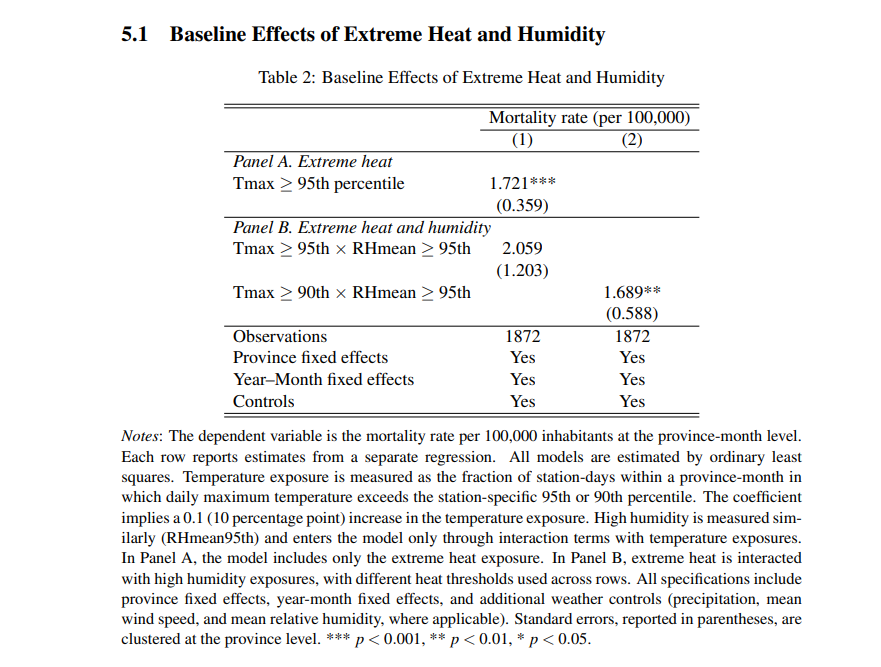
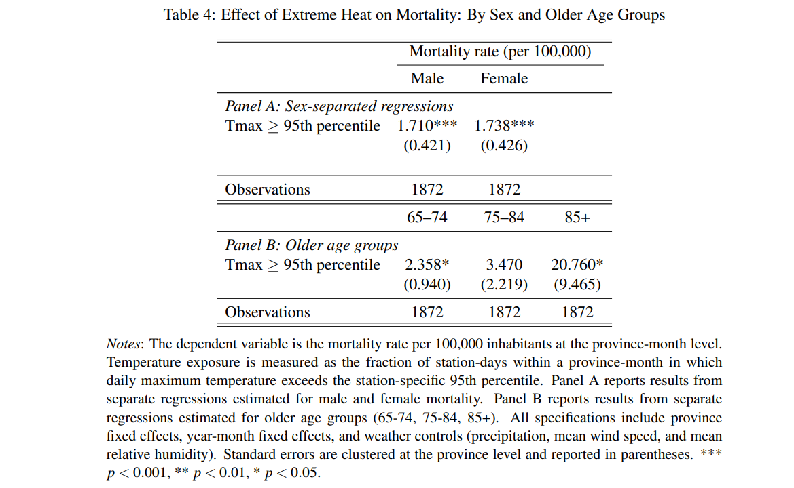
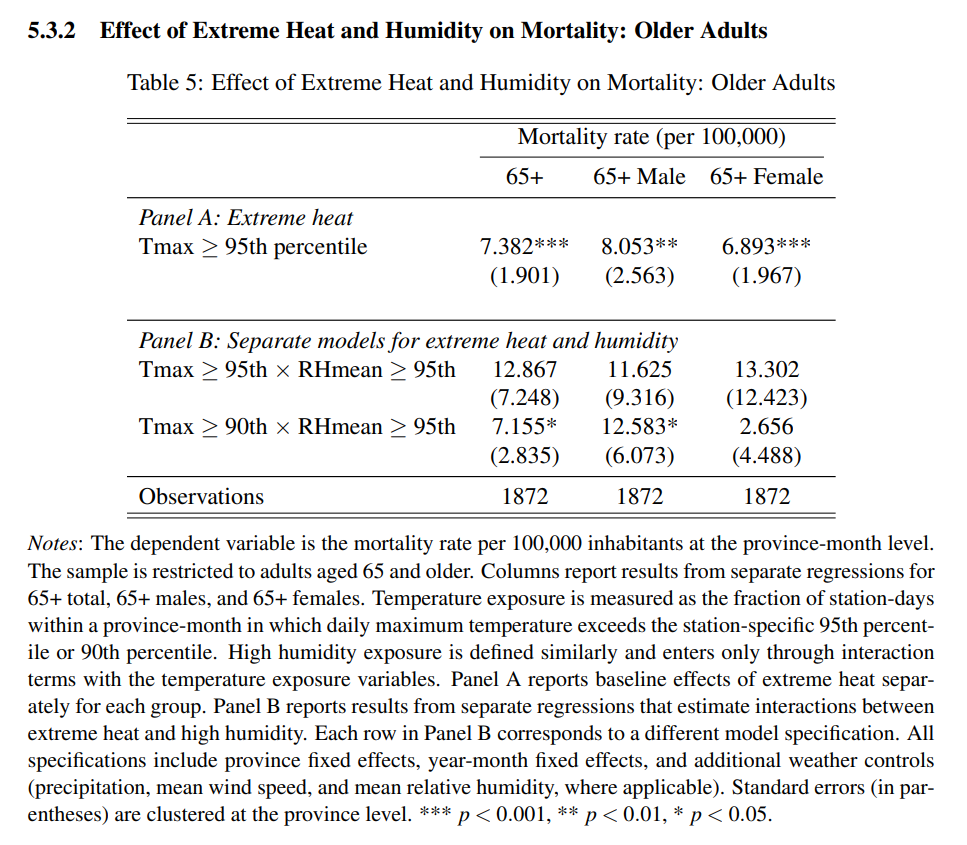
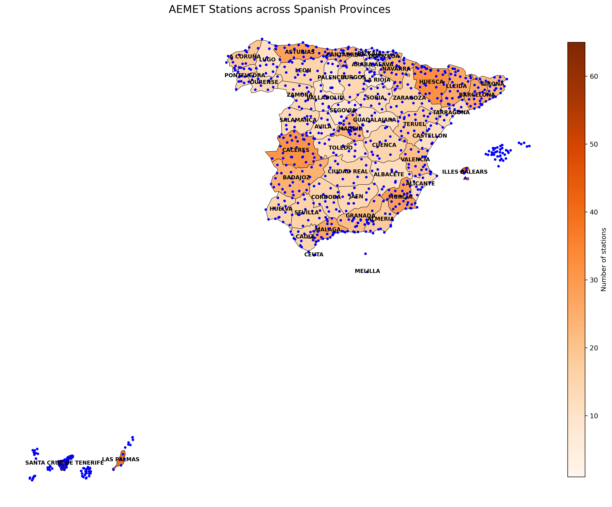

# Data_Analysis_Project_My_Masters_Thesis

Does extreme heat kill people in Spain, and who does it kill? 

I built a reproducible pipeline pulling 5,000+ files from 947 weather stations, merged them with national mortality and demographic records into a panel dataset covering 52 provinces, and estimated the effect for 2017–2019 using fixed-effects regression with demographic subgroup analysis.

## Data Sources

- Meteorological station-level daily weather data from the Spanish Meteorological Agency (AEMET)
- Regional mortality statistics from the National Statistics Institute of Spain (INE)
- Population and demographic data from INE, used for mortality normalization
- Administrative geographic boundary data for mapping (Eurostat GISCO)

## Data Scale

The project integrates multiple data sources and produces a large panel dataset containing demographic and mortality information across regions, months, age groups, and sex categories.

The final panel contains approximately:
- ~400,000+ rows
- 165 columns (variables)

The analytical subset used for the main regression analysis covers the 2017–2019 period.

## Project Workflow

1. Collect weather data from API (~5,000+ CSV files retrieved in 6-month chunks across multiple years)
2. Clean and standardize all datasets
3. Construct panel dataset and feature engineer the heat indicators
4. Run fixed effects regressions and demographic subgroup analysis
5. Generate maps and visualizations

## Tools Used

Python (pandas, numpy, statsmodels, matplotlib, geopandas)

## Key Variables

The final dataset includes constructed variables such as:
- Extreme temperature indicators (e.g. 95th percentile of maximum temperature) and their interaction with relative humidity (e.g. Tmax95 × RHmean95) to capture combined heat-humidity effects on mortality.
- Population-based mortality rates
- Mortality outcomes disaggregated by age group and sex

## Key Findings

- The analysis finds that higher extreme temperature exposure is associated with statistically significant increases in mortality rates in Spain, with effects that vary depending on humidity levels, as captured by temperature–humidity interaction terms.
- Effects are heterogeneous, with stronger impacts observed among older age groups and across sex-specific subgroups.

## Key Outputs

### Main regression results

### Age and sex heterogeneity

### High-risk subgroup (65+)

### Weather station coverage

### Regional mortality rates

## Implications & Policy Recommendations

- Results suggest that extreme heat exposure is associated with higher mortality, highlighting the need for preparedness during heat events.
- Effects are stronger for vulnerable populations, particularly older age groups, suggesting targeted adaptation policies.
- Humidity may play an additional role in heat-related health risks, suggesting that accounting for humidity should be considered in policy design.
- Evidence based on local temperature percentiles indicates that relative, location-specific thresholds may be more informative than absolute temperature levels for risk assessment.

## Repository Structure

Data/
- cleaned_dataset_sample.csv

Outputs/

tables/
- Main_results_table.png
- Demographic_results_table.png
- High-risk_subgroup_results_table.png

maps/
- Weather_stations_coverage_per_province.png
- Average_monthly_mortality_rate_by_province.png

Scripts/
- PART_1_api.py
- PART_2_weather_cleaning.py
- PART_3_mortality_cleaning.py
- PART_4_population_cleaning.py
- PART_5_demographics_merging.py
- PART_6_panel_construction.py
- PART_7_merging_all.py
- PART_8_fixed_effects_analysis.py
- PART_9_demographic_analysis.py
- PART_10_geographic_maps.py

README.md

## Notes on Data & Reproducibility

This repository contains a curated version of the thesis workflow. Raw data is not included: the weather data is collected via the AEMET API (which requires credentials), and the full pipeline produces large intermediate files. Not all robustness checks and geospatial outputs from the thesis are included here.

A sample of the cleaned panel dataset (`cleaned_dataset_sample.csv`) restricted to 10,000 rows is included so the structure of the final dataset and the logic of each script can be followed end to end.
